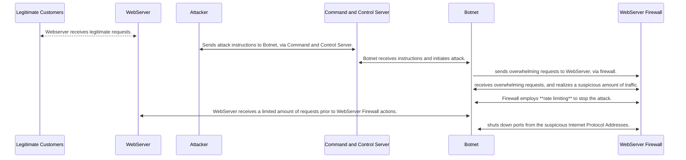

# DDoS Attack Sequence

###The following details the series of events in a Distrubuted Denial of Service Attack against a WebServer. 

1. The Attacker determines that his/her target is the WebServer. He will use a DDoS Attack to overwhelm the
   webServer. 
   * Does research on WebServer's and surrounding security architecture
   * Builds or rents Botnet to conduct attack
   * obtains a Command and Control Server to use in the attack
2. Attacker sends attack instructions to Botnet, via Command and Control Server
   * Floods the Internet Protocol (IP) address of the WebServer with overwhelming requests
   * These requests go through the WebServer Firewall first enroute to the WebServer
   * The WebServer Firewall allows the request through because they seem legitimate
3. WebServer Firewall receives overwhelming requests from the Botnet
   * The initial requests from the Botnet are routed to the WebServer and webserver experiences service 
     disruptions 
   * The WebServer Firewall analyzes the requests and the rate limit is tripped; WebServer eventually 
     blocks the Botnet requests, shutting down alerted ports
   * The WebServer Firewall continues to route non-suspicous requests from unmarked IP addresses
4. After the attack, the WebServer resumes normal services and continues to processes legitimate requests 
